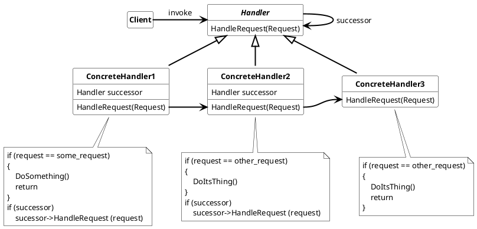

## Chain of Responsibility

Avoid coupling the sender of an request to its receiver by giving more than one objects the change to handle the request. So chaining the receiving objects passes to request along the chain until an object handles the request without forwarding the request to the next object in the chain.

Used nomenclature for Chain of Responsibility is:

* **Handler**
  * defines interface to handle requests
  * (optional) can implement the successor link
* **ConcreteHandler**
  * handle request it is responsible for
  * can have a successor link
* **Client**
  * invokes the request

### Usage

Use the Chain of Responsibility when

* more than one object can handle a request and none of the handlers know something of his precessor.
* a request is issued to more than one objects without specifing the receiver explictly. Especially when a processing order of the requests is required.
* when the set of objects to handle a request should be specified dynamically.

#### Advantages

* reduced coupling
  * handlers do not know anything about other handlers and which request they handle.
  * An object only knows about the request it handles.
* simpify the responsibility and complexity of request handlers.
* increase the testability, because each Handler can be specifically tested for processing the request
* add flexibility in assigning responsibilities to objects.
* good for hierarchial processing of a request.

#### Disadvantages

* with flexiblity comes tracking responsibility.
* No Guarantee for receipt of a request:
  * because a request can fall of the chain of responsibility without beeing processed.
  * a request may be processed before or/and not been forwarded to the successor handlers to have a change to process the request in the chain of responsibility again.