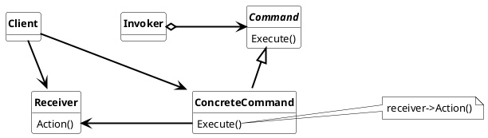

## Command Pattern

Encapsulate a request as an object. Thereby letting you parameterize clients with different requests, queue or log requests and support undorable operations.

Used nomenclature for Command Pattern is:

* **Invoker**
  * invoke the command to carry out the request
  * can be a quene or command pool
* **Client**
  * Create the ConcreteCommand object and sets its receiver
* **Command**
  * defines the interface for executing an operation

* **ConcreteCommand** 
  * defines a binding between a receiver object and an action.
  * implements Execute by invoking the corresponding operation(s) on the Receiver

### Usage

The Command pattern is used when

* parameterize objects with an action so that
  * all required data is stored in the action
  * the action can be processed at a later point.

* specify, queue and execute requests at different times.
  * lifetime can have a lifetime independent from its original request.

* undo and redo actions are requried
  * The command can store the current and previous state of the parameters before the command change the parameters. When the command it quened its possible to undo and redo the command.

* logging changes are required
  * the command can log its action to a logger.
* structuring a system around high-level operations build on primitives operations.

#### Advantages

* decouples the object that invokes the operation from the one that knows how to perform it
* Commands are first-class objects. They manipulate and extend like any other object
* You can assemble commands into a composite command.
* Its easy to add new Commands, because you don`t have to change existing classes and interfaces.
* commands are easiely testable because thy do/change only one thing
