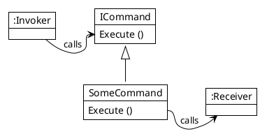

## Command Pattern
The Command Pattern is a behavioral design pattern in which an object is used to encapsulate all information needed to perform an action, trigger an event etc. now or later in time. 

Four terms always associated with the *Command* Pattern are *Command*, *Receiver* and *Invoker*. A *Command* object knows about *Receiver* and invokes a method of the Receiver. Values for parameters of the *Receiver* method are stored in the *Command*.

Its benefits are

* decouple the *Invoker* form the *Reveiver*
* make the *Reveiver* configurable for the *Invoker*
* encapsulate all information for the operation

Due to this structure the commands can be stored, executed at any time and can also be undone, if the previous information is stored in the command. It's also useable to create and execute operations to data classes without changing the interface of the data class.

It is used for

* Actions
  * GUI (Button click etc.)
  * Networking (Parallel Actions)
* Tasks
  * Parallel Processing
  * Thread pools
* Operation Storage
  * Macro recordings
  * Multi-level undo operations
  * Transactional behavior (rollback)
  * Wizards
