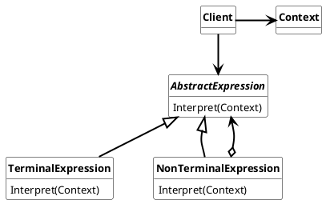

## Interpreter Pattern

Given a language, define a representation for its grammar along with an interpreter that uses the representation to interpret sentences in the language

Used nomenclature for Interpreter Pattern is:

* **AbstractExpression**
  * declares an abstract Interpreter operation that is common to all nodes in the abstract syntax tree
* **TerminalExpression**
  * implements an Interpretor operation associated with terminal symbols in the grammar
  * an instance is required for every terminal symbol in a sequence.
* **NonTerminalExpression**
  * one such class is required for every rule $R:=R_1R_2...R_n$ in the grammar.
  * maintains instance veriables of type AbstractExpression for each of the symbols $R_1$ through $R_n$
  * implements an Interpret operation for nonterminal symbols in the grammar. Interpret typically calls itself recursively on the variables representing $R_1$ through $R_n$
* **Context**
  * contains information that`s global to the interpreter
* **Client**
  * builds (or is given) an abstract syntax tree representing a particular sentence in the language that the grammar defines. The abstract syntax tree is assembled instances of the NonterminalExpression and TerminalExpression classes
  * invokes the Interpret operation.

### Usage

Use the Interpreter Pattern when

* The grammar is simple.
* efficiency is not a critical concern

#### Advantages

* easy to change and extend the grammar
* implementing the grammar is easy to
* adding new ways to interpret expressions

#### Disadvantages

* For complex grammars, the class hierarchy becomes large and unmaintainable
