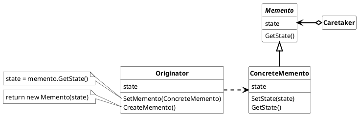

## Memento

Without violating encapsulation, capture and externalize the internal state of objects, so that the object be restored to this state later.

Used nomenclature for Memento Pattern is:

* ***Memento***
  * Stores the internal state of the Originator, so that even the state in the Originator is changed over time the stored state can be set back.
  * protect the state against other objects than the Originator. E.g. the Caretaker see only a narrowed interface in comparison to the Originator

* ***Originator***
  * implements cooperative behavior by coordinating Colleague objects.
  * knows and maintains its colleagues.
* ***Caretaker***
  * is responsible for the memento`s safekeeping
  * never operates on or examine the content of the memento

### Usage

Use the Memento pattern when

* a snapshot of the current state of the Originator is required, so that this snapshot can be restored to a later state.

#### Advantages

* It simplifies the Originator to store its state
* Can keep track of the state of the Originator and reset the states 

#### Disadvantages

* Using Mementos might be expensive depending which states are required to store, because the state is copied every time a memento is created.
* defining narrow and wide interface can be difficult in some languages
* Hidden costs in storing and track keeping for the memento in the caretaker
