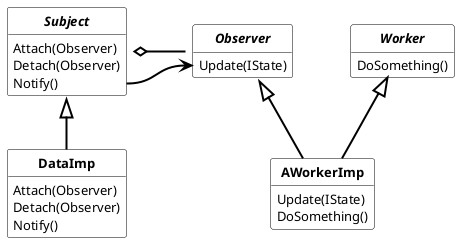
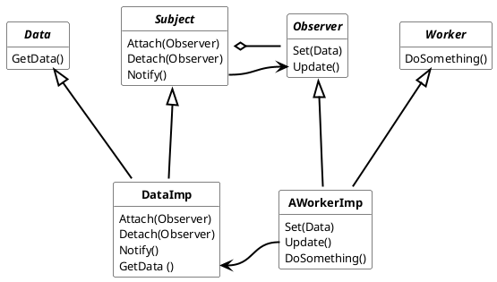

## Observer Pattern

The observer pattern is the key pattern, then an object needs to be informed that another object has changed. Event handling is one of the core uses of Observer Pattern. This pattern exists in functional programming as well as in object-oriented programming. For the sake of simplicity, the observer pattern is shown in its object-oriented form as an example.

Basically, there is always an *Observer* and the object that the *Observer* wants to observe (*Subject*, *Observable*).
In order for the *Observer* to be informed that the *Subject* has changed, it must register to the *Subject*.
When the *Subject*'s *notify ()* function is called, the *update ()* function is called for all registered *Observers*.

Depending on the used Observer pattern type, the updated information is either pushed to the *Observer* as parameter or pulled from the *Subject* by the *Observer* using a function call of the *Subject*.

### **Push Observer**

The Push Observer Pattern is the typical observer design. During the "*notify ()*" call, the information "*State*" is pushed from the "*Subject*" to the "*Observer*".

***Advantages:***

- Simple implementation
- *Observer* doesn't know anything about the *Subject*
- *IState* has a structure independent of *Object* and *Subject*
- *IState* can be different types, hence different State can the notified.

***Disadvantages:***

- In heavy load processes during the notify call IState can be out of sync.

***

### **Pull Observer**

The Pull Observer Pattern is an alternative observer design. During the *notify()* call, the *Data* information is pulled from the *Subject* by the *Observer* by calling the *Subject*'s getData() function. This design should be used when synchronization between *Observer* and *Subject* is required (e.g. high-precision clock) or when the data is so large that copying takes a while.

***Advantages:***

- In heavy load processes during the notify call Data is in sync.

***Disadvantages:***

- *Observer* knows something about the *Subject* because the *Observer* invoked a function of the *Subject*
- Another layer of abstraction is required
