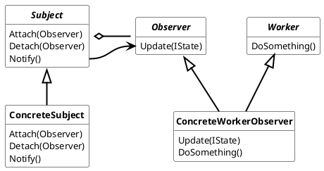
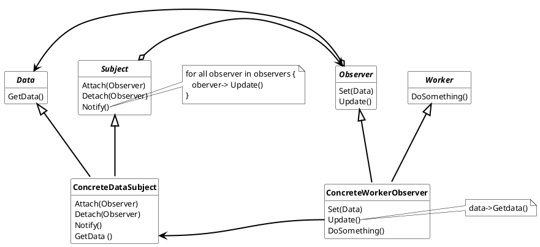

## Observer Pattern

Define a one-to-many dependency between objects so that when one object change state, all its dependents are noified and updated automatically.

There are to types of observers ***Push Observer*** and ***Pull Observer.***

### Usage Push Observer

Use this design when

* If full decoupling between Observer and ConcreteSubject is required.
* IState is not syncronization depended
* IState is small and the interation with this state is not time sonsuming

#### Advantages

* Simple implementation
* *Observer* doesn't know anything about the *Subject*
* *IState* has a structure independent of *Object* and *Subject*
* *IState* can be different types, hence different State can the notified.

#### Disadvantage

* In heavy load processes during the notify call IState can be out of sync.

### Usage Pull Observer

The Pull Observer Pattern is an alternative observer design. During the *notify()* call, the *Data* information is pulled from the *Subject* by the *Observer* by calling the *Subject*'s getData() function. This design should be used when synchronization between *Observer* and *Subject* is required (e.g. high-precision clock) or when the data is so large that copying takes a while.

#### Advantages

* In heavy load processes during the notify call Data is in sync.

#### Disadvantages

* Observer knows something about the Subject because the Observer invoked a function of the Subject e.g. The Data interface
* Another layer of abstraction is required
