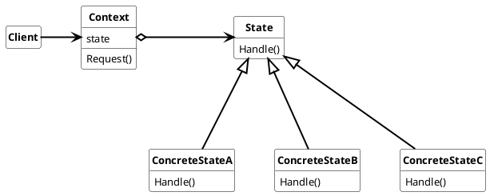

## State

Allow an object to alter its behavior when its internal state changes. An Object will appear to change its class.

the nomenclature for State Pattern is:

* ***Context***
  * defines the interface the client can use.
  * handles the request from the client based on the current concrete state it carries

* ***State***
  * defines the interface for encapsulating the behavior assosiated with a particular state of the context.
* ***ConcreteState***
  * implements the bahavior of the current state towards the state interface.

### Usage

Use State pattern when

* an object behavior depends on its state and it must change its behavior at run-time depending on that state
* operations have large, multipart conditional statements that depend on the object state.

#### Advantages

* It localizes state-specific behavior and partitions behavior for different states
  * All behaviors of one state in one object
* It makes state transitions explicit
* State objects can be shared

#### Disadvantages

* Transition encapsulation can result in unexpected behavior, Therefore should be avoided in State pattern design
* state structures can grow and become to complex. In this cases state structures should be subdivided
