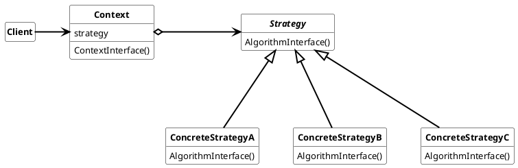

## Strategy Pattern

Defines a family of algorithm/functionality and make them interchangeable on run-time.

the nomenclature for State Pattern is:

* ***Context***
  * is configured with a ConcreteStrategy.
  * maintains a reference to the Strategy
  * may contain an interface to access the Strategy data

* ***Strategy***
  * defines the common interface used for all supported algorithms. Context uses this interface to call the algorithm defined by the ConcreteStrategy
* ***ConcreteStrategy***
  * implements a specific algorithm defined by the Strategy interface.

### Usage

Strategy pattern should be used when

* many related claases differ only in ther implementation.
* is required to have many algorithms/functions add run-time and want to switch between this algorithm ad run-time.
* algorithm/functions uses data that client shouldn`t know about
* based on conditions the behavior of a class must be adapted.

#### Advantages

* high flexibility to change algorithms/functionality at run-time
* supports dependency injection and testability

#### Disadvantages

* Pointer indirection causes overhead and therefore is not suitable for time critical operation. If this is the case and the decision, which strategy is required, can be made at compile time, use Template Pattern.
