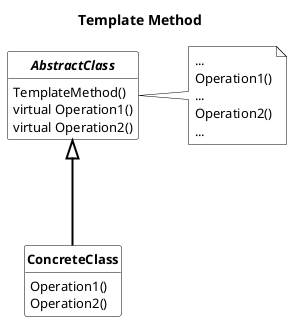
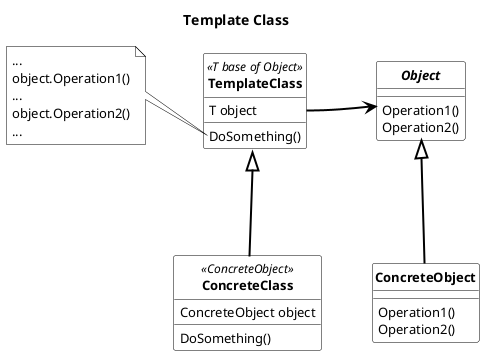

## Template (Method) Pattern

Define the skeleton of an algorithm/functionality.
The Template Method pattern deferring some steps to the algorithm/functionality to subclasses.
The Template Class uses a template object with can be replaced. For better operation the template object can have some requirements like an interface which can be implemented by subclasses.

### Usage

Template (Method) pattern should be used

* to implement the invariant part of an algorithm/functionality once and leave it up to the subclasses or template object to implement the behavior that can/should vary.
* when common behavior among subclasses should be factored and localized in a common class to avoid code duplication.
* to control subclasses behavior
* to define dependency injection objects at compile time without the requirement to change the objects at run time.  

#### Advantages

* less code duplication
* support inversion of control mechanism by default
* in the case of Template Method, can be changed on run time
* In the case of Template Class, no pointer indirection, because the Template Objects are defined at compile time and can therefore be directly added as members.

#### Disadvantages

* common code separation make subclasses less flexible to optimize specific section of the algorithm.

* In case of template method, pointer indirection in dependency injection may result in additional overhead.
* In case of template classes, they are defined at compile time so they cannot be switched at run-time
* some language doesn`t support generic interfaces
