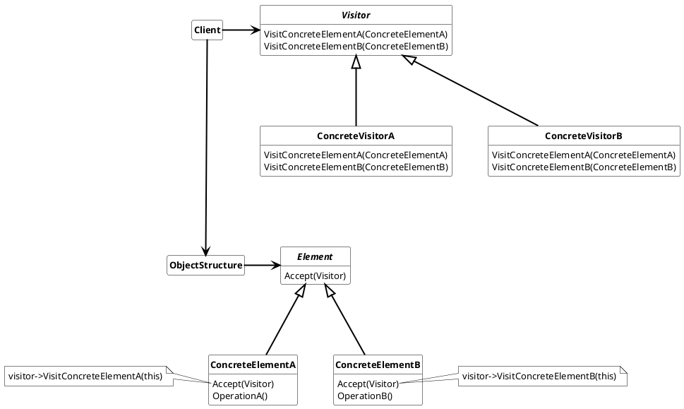

## Visitor Pattern

Represent an operation to be performed on the lemements of an object structure. Visitor lets you define a new operation without changing  the classes of the elements on which it operates.

the nomenclature for Vistor Pattern is:

* ***Visitor***
  * declares a visit operation for each class of ConcreteElement in the object structure.
* ***ConcreteVisitor***
  * implements each operation declared by the Visitor interface. Each operation is an fragment of the algorithm defined for the corresponding class in the structure
* ***Element***
  * defines the Accept operation that takes the visitor as an arguement.
* ***ConcreteElement***
  * implements the Accept operation that takes a visitor as an arguement and call the specific function of the visitor for the Element implementation

### Usage

Use Visitor pattern when

* an object structure contains many classes of objects with differing interfaces and you want to perform operations on these objects that depend on their concrete classes
* many destinct and unrelated operations need to be performed on objects in an object structure and you want to avoid "polluting" theses object with this operations
* the classes (Elements) rarely change, but you often define new operations on this classes.

#### Advantages

* Visitor makes adding new operations easy
* A visitor gathers related operations and separates unreleated ones.
* visiting elements accross the class hierarchy
* visitors can accumulate states

#### Disadvantages

* Adding new ConcreteElement classes is hard, because each visitor has to implement the operation for the ConcreteElement
* strong coupling between Visitor and ConcreteElements
* Visitor breaks encapsulation.
