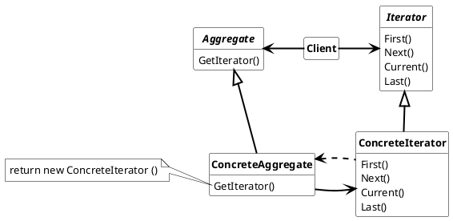

## Iterator Pattern

Provide a way to access the elements of an aggregate object sequentially without exposing its underlying representaion

Used nomenclature for Iterator Pattern is:

* **Interator**
  * defines the interface for accessing and transversing elements.
* **ConcreteIterator**
  * implements the interfaceof the Iterator
  * keep track of the current position in the aggregate.
* **Aggregate**
  * defines interface for getting Iterators
* **ConcreteAggregate**
  * implements the interface of Aggregate
  * contains elements.

### Usage

Iterator pattern is used when

* accessing an aggregate object`s content without exposing its internal representaiton
* multiple traversals of aggregate objects are required or want to be supported
* provide an universal interface for different aggregate structures

#### Advantages

* Support variations in the traversal of an aggregate.
* simplify the aggregate interface
* More than one traversal can be pending on an aggregate.

#### Disadvantages

* Universal interface limits efficient algorithm for specific tasks. (e.g. search in binary and vector are different, but handled the same way using an iterator).

