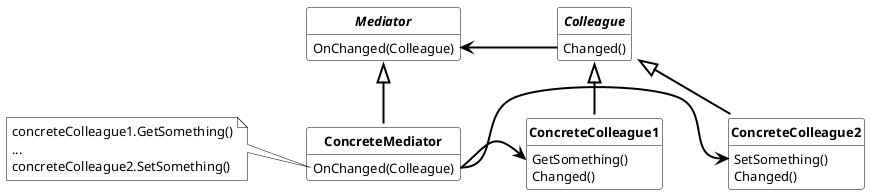

## Mediator Pattern

Define an object that encapsulate how a set of objects interact. Mediator promotes loose coupling by keeping objects from referring to each other explicitly, and it lets you vary therir interaction independently.

Used nomenclature for Mediator Pattern is:

* ***Mediator***
  * defines the interface for communicating with Colleague classes
* ***ConcreteMediator***
  * implements cooperative behavior by coordinating Colleague objects.
  * knows and maintains its colleagues.
* ***Colleague***
  * each Colleague class knows its Mediator object
  * each colleague communicates with its mediator whenever it would have otherwise communicated with other colleague.

### Usage

Use the Mediator pattern when

* a set objects communicate in well-defines but complex ways. The resulting interdependencies are unstructured and difficult to unterstand.

* reusing an object is difficult because it refers to and communicates with many other objects

* a behavior that`s distributed between several classes should be customizable without a lot of subclassing.

#### Advantages

* It limits subclassing, because the mediator localize behavior that otherwise would be distributed among several objects
* It decouple colleague objects, because they don˚t have to know other colleague which depend on there changes
* It simplifies the object protocol interactions from a many to many communication to a single to many communication.
* Centerlize the control of interactions between different colleagues.

#### Disadvantages

* Due to its centerlized roll, the mediator could grow to a god like interaction class.
