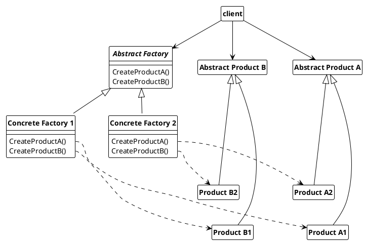

## Abstract Factory

An abstract factory combines the responsibilities of "summarizing object generation in one place", "Separate the responsibility of creation and usage of an object" and "possibility for abstract constructors".

### Usage

The abstract factory is used when

* a system should work independently on how its products are created, composed and represented.
* a system should be configured with one or more product families.
* a group of products is designed to be used together, and not needed to enforced this constraints
* the interfaces of products are to be provided in a class library without their implementation.

***Advantages:***

* the client is isolated from concrete classes
* the exchange of product families is possible in a simple manner

***Disadvantage:***

* using concrete functions it is difficult to add new product types as changes have to be made in all concrete factories.

> The disadvantage can be reduced in some cases by decoupling the concrete creation functions with a single one. This decouples the creation process even more, since the decision rests entirely with the factory. However, this only makes sense if the offered interface is sufficient for the consumer.
