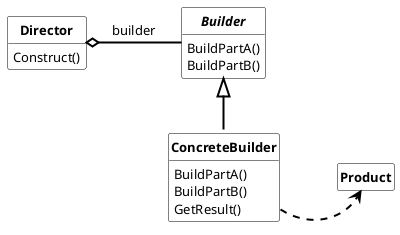
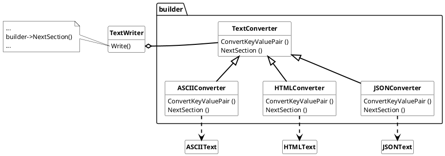

## Builder pattern

The builder pattern separate the construction of a **complex** class from its represenation, so that the same construction process can create different representations. It's used together with the **component pattern** and/or the **strategie pattern** to create complex classs.

> *In contrast to the (Abstract) Factory pattern the builder pattern builds the class step by step and returns it at a final step. Abstract Factories provide a family of products und return it immediately.*

### Usage

The builder pattern should be used when

* the algorithm for creating a complex class should be independent of the parts that make up the class and how they're assembled.
* the construction process must allow different representations for the class that's constructed.

### Example

basic example to build different TextFormat-Files with the builder 
pattern

