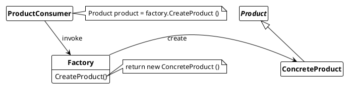

## Factory Pattern
Define an interface for creating an object, but let subclasses decide which class to instantiate. Factory Method lets a class defer instantioation to subclasses.

### Usage

Use Factory Method pattern when

* a class can't anticipate the class of objects it must create
* a class wants its subclasses to specify the objects it creates
* classes delegate responsibility to one of several helper subclasses, and want to localize the khnowledge of which helper subclass is the delegate.

***Advantages:***

* more separation of responsibility (way to SRP and DI)
* unify the generation of objects (for all consumers)
* creation knowlegde should be stored at one place
* changes in object generation only should effect the factory but not the consumers.

***Disadvantages:***

* more code to write
* Creation process is slower

