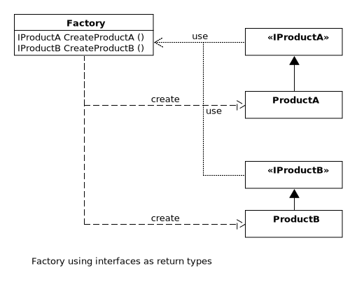

## Factory Pattern

A factory is a class that generates objects through a function call instead of creating the object through a constructor. The factory serves as a rallying point for creating similar objects that can be grouped together as part of their affiliation (eg. ProductA and ProductB).

The following advantages result from the separation of the object generation and it's usage
* Unified generation of the object (for all consumers)
* Replacing the generation of the object is easy
* Changes in object generation only affect the factory, not its consumers
* Less coupling between the generated object and its comsumers

>By introducing interfaces as returning types from the factory, the coupling can further reduced. 

>Using a unified CreateFunction (e.g. CreateProduct) that creates the appropriate object via a parameter (enum or string) decouples the object even more, since the decision rests entirely with the factory. However, this only makes sense if the offered interface is sufficient for the consumer.

>A complete decoupling, however, can only realized with the abstraction of the factory itself "see Abstract Factory".

