## Monostate pattern
The Monostate pattern is a variation of the singleton pattern.
It enforcing singular behavior, without imposing constraints on structure.  

```plantuml
@startuml monostate
!theme plain

skinparam nodesep 50
skinparam ranksep 40
hide circle
class "**Monostate**" as mmnostate {
    Get()
    Set(...)
    ---
    static variable_
}

@enduml
```

### Usage

***Advantages***

* users do not need to know that the object they use, is a Monostate.
* derivatives of a Monostate continue to share static variables.
* only private static variables are shared, derivatives are free to override any methods of the base class.
* being static, the variables of a Monostate have specific creation and destruction times.
* more testable then a singleton, because its polymorphic state allows to override its behavior for mocks, stubs or fakes.

***Disadvantages***

* you cannot derive a Monostate from a non-Monostate.
* a Monostate might go through many creations and destructions, which might be quite expensive, depending on implementation.
* even if the Monostate is never used, its variables take up space
* they cannot be shared by multiple CLR instances.
* locking is required in multiple threads.

> *SINGLETON is best used when you have an existing class that you want to constrain through derivation and don’t mind that everyone will have to call the Instance() method to gain access. MONOSTATE is best used when you want the singular nature of the class to be transparent to the users or when you want to use polymorphic derivatives of the single object*

---

> **AVOID SINGLETONS AND MONOSTATES. A single instance can also be used by creating just one instance and then passing it to consumer classes via dependency injection.**
