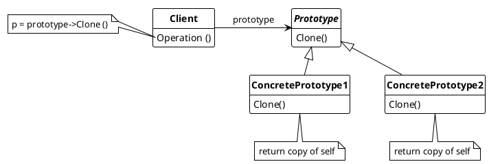

## Prototype

Specify the kinds of objects to create using a prototypical instance, and create new objects by copying this prototype

## Usage

Use Prototype pattern when a system should be independent of how products are created, composed and presented; and

* when the classes to instantiate are specified at run-time, e.g by dynamic loading
* when building the classes of factories parallels the class hierachy of products
* when instances of a class can have one of few combination states. Therefore using prototypes can reduce the overhead of instanciating the classes manually.
* when coping of a class depends on it's state.

