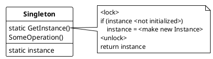

## Singleton 

Ensure a class has only instance, and provide a global point of access to it.

### Usage

Use the Singleton pattern when

* there must exactly one instance of a class, and it must be assessible to clients from a well-known access point
* the sole instance should be extensible by subclasses, and clients should be able to use an extended instance without modifying ther code

> *Because of the single instance Singletons will be a bottleneck in multithread applictions. Also using Singletons in code reduces the testability of code. Hence try to avoid using singletons.*

---

> **AVOID SINGLETONS AND MONOSTATES. A single instance can also be used by creating just one instance and then passing it to consumer classes via dependency injection.**
