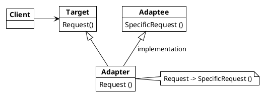
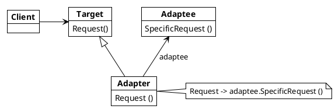

## Adapter

Convert the interface of a class into another interface clients expects. Adapter classes work together that couldn't otherwise because they have incompatible interfaces.

Adapters can be created using inheritane and using composition. The nomenclature is

* **Target** -> defines the domain specific interface that *Client* use
* **Client** -> collaborates with objects conforming to the *Target* interface
* **Adaptee** -> defines exising interface that need adapting
* **Adapter** -> adapts the interface of the *Target* with the interface of the *Adaptee*

---

***Adapter pattern using inheritance***

---
***Adapter pattern using composition***

---

### Usage

Use Adapter pattern when

* you want to use an existing class, but its interface doesn't match the interface you need.
* you want to create a reusable class that cooperates with an unrelated or unforeseen classes, that is, classes that don't necessarily habe compatible interfaces
* you need to use serveral existing subclasses, but it's impractical to adapt ther interface by subclassing every one. An object adapter can adapt the interface of its parent class.
