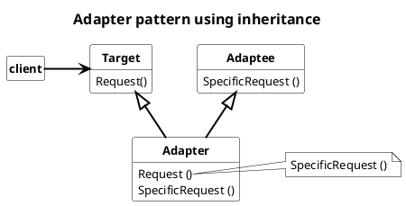
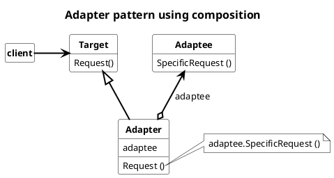

## Adapter

Converts a class's interface into another interface client expects. Adapter classes therefore allow classes that otherwise cannot work together because they have incompatible interfaces.

Adapters can be created using inheritance or using composition.

The nomenclature is

* **Target**
  * defines the domain specific interface that *Client* use
* **Client**
  * collaborates with objects conforming to the *Target* interface
* **Adaptee**
  * defines exising interface that need adapting
* **Adapter**
  * adapts the interface of the *Target* with the interface of the *Adaptee*

### Usage

Use Adapter pattern when

* when an existing class is to be used, but the interface of the class does not match the required interface.
* to create a reusable class that interoperates with unrelated or unexpected classes, that is, classes that don't necessarily have compatible interfaces.
* multiple existing subclasses will need to be used, but it is impractical to customize the interface by subclassing all of them. An object Adapter can customize the interface to its parent class.

#### Advantages

Class Adapter:

* Adapter can override some of Adaptee`s behavior
* No pointer indirections because Class Adapter requires a concrete adapter as member.

Object Adapter:

* A single adapter can handle Adaptee`s subclassing

#### Disadvantages

Class Adapter:

* Adapter for each Adaptee subclass is required.

Object Adapter:

* Overriding some of Adaptee`s behavior becomes hard, because it will influence all Adaptees implementations
* Pointer indirections
