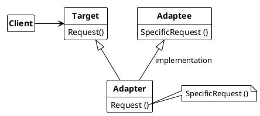
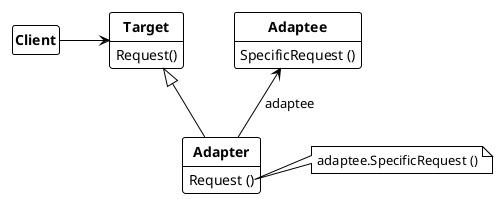

## Adapter

Converts a class's interface into another interface client expects. Adapter classes therefore allow classes that otherwise cannot work together because they have incompatible interfaces.

Adapters can be created using inheritance or using composition. The nomenclature is

* **Target**
  * defines the domain specific interface that *Client* use
* **Client**
  * collaborates with objects conforming to the *Target* interface
* **Adaptee**
  * defines exising interface that need adapting
* **Adapter**
  * adapts the interface of the *Target* with the interface of the *Adaptee*

---

***Adapter pattern using inheritance***

---
***Adapter pattern using composition***

---

### Usage

Use Adapter pattern when

* when an existing class is to be used, but the interface of the class does not match the required interface.
* to create a reusable class that interoperates with unrelated or unexpected classes, that is, classes that don't necessarily have compatible interfaces.
* multiple existing subclasses will need to be used, but it is impractical to customize the interface by subclassing all of them. An object adapter can customize the interface to its parent class.