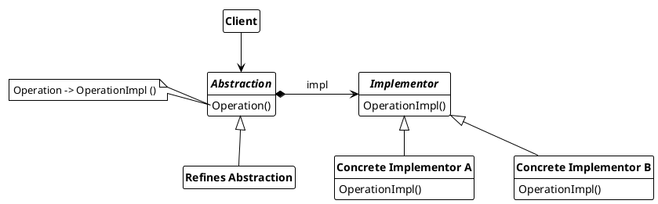

## Bridge

Bridges decouple the abstraction from its implementation so that the two can vary independently.

Used nomenclature for bridges are:

* **Abstraction**
  * defines the abstraction interface
  * maintaines a reference to an object of type *Implementation*
* **Refined Abstraction**
  * extends the interface defined by the *Abstraction*
* **Implementor**
  * defines the interface for implementation classes. This interface doesn't have to correspond exactly *Abstraction* interface. Typically the *Implementator* interface provides only primitive operations, and Abstraction defines higher-level operations based on these primitives
* **ConcreateImplementor**
  * implementation the *Implementor* interface and defines its concrete implementation.

---

---

### Usage

Bridges can be used when

* a permanent binding between an abstraction and its implementation should be avoided. For example, to switch or replace the implementation during runtime.
* both the abstractions and their implementations are to be subclassable. The bridge pattern allows different abstractions and implementations to be combined and expanded independently of one another.
* changes in the implementation of an abstraction should habe no impact to the client
* the implementation on an actraction should be completely hidden for the client (e.g. c++)
 
