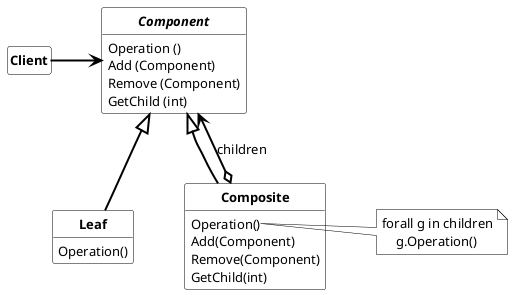

## Composite Pattern

Assembles objects into tree structures to represent part-whole hierarchies. Composite allows clients to treat individual objects and compositions of objects consistently.

* **Component**
  * declares the interface for objects in the compostion
  * implements default behavior for the interface common to all classes as appropriate
  * declares an interface for accessing and managing its child components.
  * (optional) defines an interface for accessing a Component's parent in recursive structure, and implements it if that's appropiate.
* **Leaf**
  * represents Leaf objects in the composition. A Leaf has no problems
  * defines behavior for primitive objects in the composition
* **Composite**
  * defines behavior for components having children
  * stores child components
  * implements child-related operations in the Component interface.
* **Client**
  * manipulates objects in the composition through the Component interface.

### Usage

Use the Composite pattern when

* part-whole hierachies of objects should be represented
* clients should be able to ignore the difference between compositions of objects (Composite) and individual objects (Leaf). Clients will use both type of objects in a Composite structure uniformly

#### Advantages

* client can be simple
* client has not to be changed when adding new Composite elements
* Compose complex objects based on simple ones
* easy to create new kinds of Composite elements
* simple and general design

#### Disadvantages

* hard to restrict composition (Composition of an object limited by a specific set of Components)
* complex objects are hard to analyse for a specific Component
* loosing type safty on compile type for the components.

> In the case of the periodic processing of components of the Composite, the Composite pattern has the disadvantage that each Composite must first be searched for the Component before the Component can be processed. This can be time-consuming for large objects. It is therefore advisable to switch to the Entity Component System Pattern (ECS) for such problems. Here the Component is decoubled from the entity and will be processed in the system.
