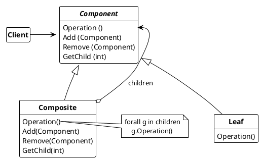

## Composite pattern

Assembles objects into tree structures to represent part-whole hierarchies. Composite allows clients to treat individual objects and compositions of objects consistently.

* **Component**
  * declares the interface for objects in the compostion
  * implements default behavior for the interface common to all classes as appropriate
  * declares an interface for accessing and managing its child components.
  * (optional) defines an interface for accessing a component's parent in recursive structure, and implements it if that's appropiate.
* **Leaf**
  * represents leaf objects in the composition. A leaf has no problems
  * defines behavior for primitive objects in the composition
* **Composite**
  * defines behavior for components having children
  * stores child components
  * implements child-related operations in the Component interface.
* **Client**
  * manipulates objects in the composition through the Component interface.

