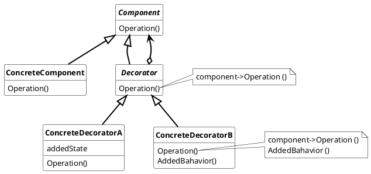

## Decorator
The decorator pattern offers the possibility to dynamically attach additional functionalities and responsibilities to an object. The function of the original object is not extended by subclassing, but by passing the object as a component to the decorator, which contains the additional functionality.

---

Used nomenclature for decorator are:

* **Component**
  * defines the interface for objects that can have functionality/responsiblity attached dynamically
* **ConcreteComponent**
  * defines an object where additional functionality/responsiblity can be attached
* **Decorator**
  * maintains a ref
erence to a *Component* object and has the *Component* interface, so that it can be used as Component  
* **ConcreateDecorator**
  * adds functionality/resonsibility to the *Component*

---

### Usage

Decorator are used to

* add functionality/responsiblity to existing individual objects dynamically without affecting other objects.
* for functionality/responsiblity, which can be withdrawn from objects
* when extension by subclassing is impractial.
* for adding the same functionality/responsiblity to different Components, without extending them all.

#### Advantages

* higher flexibitity than static inheritance, because the functionality can be added at runtime, without destroying and recreating the object with its function.
* avoids feature overloading classes high up in the hierarchy
* properties can be added multiple times to an object. 
* the decorator responsibitity can be reduced to one property of an object.
  
#### Disadvantages

* Decorator and it's Component are not equal. So the identification which object is decorated becomes complex, because from a object point of view the seen object is the decorator, not the "decorated object." Therefore, the use of the decorator pattern in systems that are based on object recognition does not make sense or is difficult to use.

* When using a lot of decorator classes, it becomes difficult to track the order of adding and removel of the decorators.

* If many decorator classes are created for an object, it becomes difficult to test all possible combinations for possible interactions.