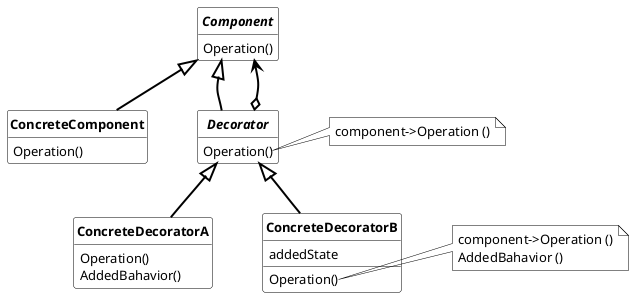

## Decorator

```plantuml
@startuml decorator
skinparam nodesep 50
skinparam ranksep 50
skinparam class {
    FontSize 13
    AttributeFontSize 13
    FontStyle bold
    BackgroundColor transparent
    BorderColor black
}
skinparam arrow {
    Color black
    FontColor black
    Thickness 2
}
skinparam note {
    BackgroundColor transparent
    BorderColor black
}

hide circle
hide fields
interface Component {
    Operation()
}
class ConcreteComponent extends Component {
    Operation()
}
abstract Decorator extends Component {
    Operation()
}

ConcreteComponent -r[hidden] Decorator

class ConcreteDecoratorA extends Decorator {
    Operation()
    AddedBahavior()
}
class ConcreteDecoratorB extends Decorator {
    Operation()
    addedState
}
show ConcreteDecoratorB fields

ConcreteDecoratorA -r[hidden] ConcreteDecoratorB

Component <--o Decorator

note right of Decorator::Operation
    component->Operation ()
end note

note right of ConcreteDecoratorB::Operation
    component->Operation ()
    AddedBahavior ()
end note

@enduml
```
