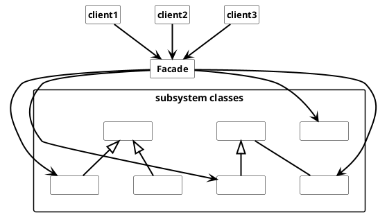

## Facade Pattern

The Facade defines a higher-level interface that makes the subsystem easier zu use.

Used nomenclature for Facade is:

* **Facade**
  * knows the subsystem classes and which are responsible for a request
  * delegate request to the appropriate subsystem objects
* **subsystem classes**
  * implement subsystem functionality
  * handle the work by the Facade object.
  * have no knowledge of the Facade

### Usage

Use the Facade pattern when

* provide simple interface for complex subsystems.
* reduce the complexity of the interaction in the subsystem for clients
* reduce the dependencies between client and and the subsystem
* when layer different subsystems

#### Advantages

* shields the complexity of subsystems from the client
* promote weaker coupling between clients and subsystem

#### Disadvantages

* does not protect the application to use the subsystem directly without the Facade
* Facade can become a "god" class or difficult to test if the subsystems is huge.
