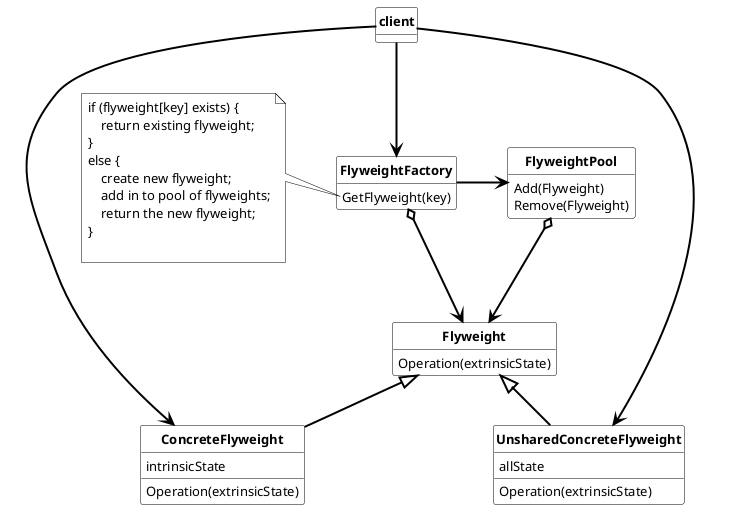

## Flyweight

Flyweight are used to support large numbers of fine-grained objects efficiently.

Used nomenclature for Flyweight is:

* **Flyweight**
  * declares an interface through which flyweights can receive and act on extrinsic state.
* **ConcreteFlyweight**
  * implements the Flyweight interface and adds storage for intrinsic state. It must be sharable object. Any state must be intrinsic that is independent from the ConcreteFlyweight
* **UnsharedFlyweight**
  * implements the Flyweight interface but is not a shareable object. It can contain shareable ConcreteFlyweight objects as children.
* **FlyweightFactory**
  * create and manages Flyweight objects in a FlyweightPool.
  * ensures that Flyweight objects are shared properly.
* **Client**
  * maintains a reference to flyweights
  * computes and store the extrinsic state of the flyweights.

### Usage

Flyweight can be used for

* application with large numbers of objects
* storage costs are high because of the number of objects
* most Objects states can be made extrinsic.
* reduce many objects by relative few shared objects once extrinsic state is removed

#### Advantages

* if implemented correctly Flyweight can reduce the number of used objects significently
* based on the implementation the number of intrinsic states of an object can be reduced.
* stored extrinsic stages {typically in array} can be computed more cache friently.

#### Disadvantges

* good flyweight design can be hard, especially in growing systems with growing states.
