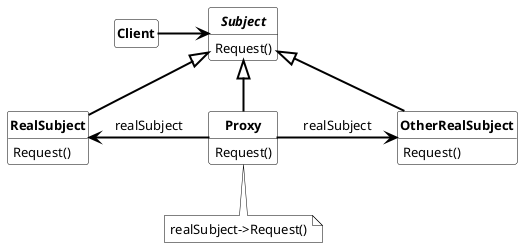

## Proxy Pattern

Provide a surragate or placeholder for another object to control access to it

Used nomenclature for Proxy is:

* **Proxy**
  * maintains a reference that lets the proxy access the real subject
  * provides the interface of the Subject to be interchangable for the real object
  * controls the access to the RealSubject and may be responsible for creation and destruction of the object
  * addional responsibility depends on the type of proxy:
    * remote proxy encoding and decoding of request and respond messages to and from the real object
    * protection proxy: do checks that the caller has access permissions to the required to perform a request.  
    * virtual proxy: may cache additional information of the RealSubject so that they can defer access to it.
* **Subject**
  * defines the interface used by the Proxy and the RealSubject
* **RealSubject**
  * defines the real object that the proxy uses

### Usage

* *smart pointer*
  * contain additional information towards raw pointers an is responsible for creation, destruction, reference counting, access validation, etc..
* *remote proxy*
  * provides a local representation for an object on a different address or on another machine
* *virtual proxy*
  * creates expensive object on demand.
* *protection proxy*
  * can be used to handle access rights to specific objects.
